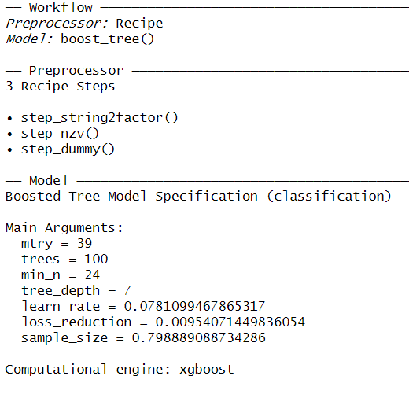
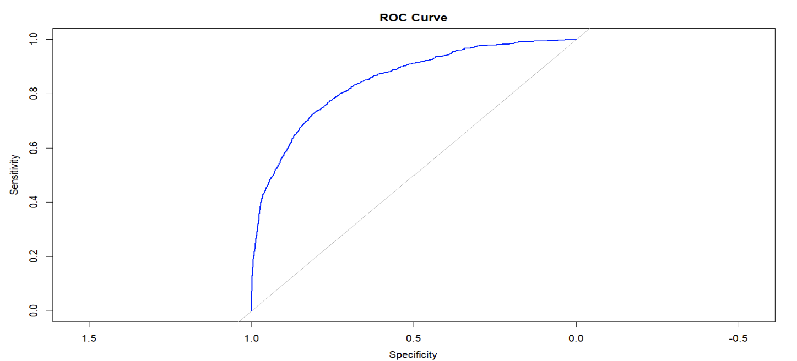

#### [<back to projects](./projects.md)
# Classification of High Booking Airbnb Properties
## Introduction
In the rapidly growing short-term rental market, making decisions based on solid data is essential for improving property management and increasing guest satisfaction. This file centers on cleaning and refining an Airbnb dataset , preparing it for further analysis that could influence the strategic choices of local hosts and stakeholders. This dataset contains comprehensive information about the listings information, including details about the hosts, spatial data, pricing, reviews, and other attributes that describe the properties listed on Airbnb.

#### Load Libraries
```{r}
library(dplyr)
library(tidyverse)
library(ggplot2)
library(pROC)
library(caret)
library(recipes)
library(tidymodels)
library(tune)
library(yardstick)
library(xgboost)
library(vip)
```

#### Read in the Test and Training sets
```{r}
df_og <- read.csv("C:/Users/svolp/OneDrive/Desktop/DS 810 Big Data/airbnb-project-msba-kaggle-train.csv", header = T, sep = ",")

airbnb_test_og <- read.csv("C:/Users/svolp/OneDrive/Desktop/DS 810 Big Data/airbnb-project-msba-kaggle-test.csv", header = T, sep = ",")
```

#### Cleaning Training  and Test Data
```{r}

# Remove dollar signs
remove_dollar_sign <- c("price", "extra_people", "weekly_price", "monthly_price", "cleaning_fee", "security_deposit")

df_big <-
  df_og %>%
  mutate_at(remove_dollar_sign, ~str_replace_all(., pattern="\\$", replacement="")) %>%
  mutate_at(remove_dollar_sign, ~str_replace_all(., pattern=",", replacement="")) %>%
  mutate_at(remove_dollar_sign, ~as.numeric(.))


# Remove percentage signs
remove_pct_sign <- c("host_response_rate", "host_acceptance_rate")

df_big <-
  df_big %>%
  mutate_at(remove_pct_sign, ~str_replace_all(., pattern="\\%", replacement="")) %>%
  mutate_at(remove_pct_sign, ~as.numeric(.)) %>%
  mutate_at(remove_pct_sign, ~./100)

#### Getting daily price for columns that only have weekly or monthly price
df_big <- df_big %>%
  mutate(
    price = ifelse(is.na(price) & !is.na(weekly_price), weekly_price / 7,
                   ifelse(is.na(price) & is.na(weekly_price), monthly_price / 30, price))
  )

# similar for market (probably not needed)
df_big <- df_big %>%
  mutate(
    market = if_else(is.na(market), city, market)
  )


#### Clean Test data as well
airbnb_test <-
  airbnb_test_og %>%
  mutate_at(remove_dollar_sign, ~str_replace_all(., pattern="\\$", replacement="")) %>%
  mutate_at(remove_dollar_sign, ~str_replace_all(., pattern=",", replacement="")) %>%
  mutate_at(remove_dollar_sign, ~as.numeric(.))

# Remove percentage signs

airbnb_test <-
  airbnb_test %>%
  mutate_at(remove_pct_sign, ~str_replace_all(., pattern="\\%", replacement="")) %>%
  mutate_at(remove_pct_sign, ~as.numeric(.)) %>%
  mutate_at(remove_pct_sign, ~./100)


#### Getting daily price for columns that only have weekly or monthly price
airbnb_test <- airbnb_test %>%
  mutate(
    price = ifelse(is.na(price) & !is.na(weekly_price), weekly_price / 7,
                   ifelse(is.na(price) & is.na(weekly_price), monthly_price / 30, price))
  )


```


```{r}
df <- df_big %>%
  select(high_booking, review_scores_rating, review_scores_accuracy, host_is_superhost, accommodates, 
         host_response_time, beds, host_response_rate, host_acceptance_rate, instant_bookable, cleaning_fee, listing_url, host_id, room_type, bathrooms, bedrooms, beds, square_feet, price, weekly_price, monthly_price, guests_included, extra_people, minimum_nights, maximum_nights, review_scores_rating, review_scores_accuracy, reviews_per_month, host_verifications, host_has_profile_pic, host_identity_verified, amenities, security_deposit, is_business_travel_ready, minimum_minimum_nights, maximum_minimum_nights, minimum_maximum_nights, maximum_maximum_nights, maximum_nights_avg_ntm, minimum_nights_avg_ntm, latitude_cleansed, longitude_cleansed, neighbourhood_cleansed)
```


#### A bunch of mutates Training set
```{r}
df <- df %>% 
  mutate_if(is.logical, as.numeric) %>% 
  mutate(cleaning_fee = ifelse(is.na(cleaning_fee), 0, cleaning_fee)) %>%
  mutate(host_is_superhost = ifelse(is.na(host_is_superhost), 0, host_is_superhost)) %>% 
  mutate(log_price = ifelse(price == 0, 0, round(log(price), 4))) %>% 
  mutate(review_scores_accuracy = ifelse(is.na(review_scores_accuracy), 0,(review_scores_accuracy))) %>%
  mutate(instant_bookable = ifelse(is.na(instant_bookable), 0,(instant_bookable))) %>%
  mutate(host_response_time = ifelse(is.na(host_response_time), "N/A", host_response_time)) %>% 
  mutate(host_response_time = factor(host_response_time, levels = c("within an hour", "within a few hours", "within a day", "a few days or more", "N/A"))) %>% 
  mutate(entire_home_apt = as.numeric(room_type == "Entire home/apt")) %>%
  mutate(private_room = as.numeric(room_type == "Private room")) %>%
  mutate(shared_room = as.numeric(room_type == "Shared room")) %>% 
  mutate(hotel_room = as.numeric(room_type == "Hotel room")) %>%
  mutate(listing_id = as.numeric(substr(listing_url, 30, nchar(listing_url)))) %>% 
  mutate(response_code = case_when(
    host_response_time == "within an hour" ~ 10,
    host_response_time == "within a few hours" ~ 7,
    host_response_time == "within a day" ~ 3,
    host_response_time == "a few days or more" ~ 2,
    host_response_time == "N/A" ~ 1,
    TRUE ~ NA_integer_  # If none of the above conditions match, return NA
  ))

# Train recipe imputing
rec <- recipe(~ ., data = df) %>%
step_impute_median(beds, bedrooms, accommodates, bathrooms, minimum_nights, maximum_nights, extra_people, square_feet, cleaning_fee, security_deposit) %>%  # Impute means
  step_impute_mean(host_acceptance_rate, host_response_rate, log_price, price, reviews_per_month, review_scores_rating) 

# Apply the recipe to the data
processed_data <- prep(rec) %>% bake(new_data = NULL)

# View the processed data
processed_data <- processed_data %>%
  mutate(high_booking = as.factor(high_booking))
```

#### Do the same thing to test data
```{r}
airbnb_test <- airbnb_test %>% 
  mutate_if(is.logical, as.numeric) %>% 
  mutate(cleaning_fee = ifelse(is.na(cleaning_fee), 0, cleaning_fee)) %>%
  mutate(host_is_superhost = ifelse(is.na(host_is_superhost), 0, host_is_superhost)) %>% 
  mutate(log_price = ifelse(price == 0, 0, round(log(price), 4))) %>%
  mutate(review_scores_accuracy = ifelse(is.na(review_scores_accuracy), 0,(review_scores_accuracy))) %>%
  mutate(instant_bookable = ifelse(is.na(instant_bookable), 0,(instant_bookable))) %>%
  mutate(host_response_time = ifelse(is.na(host_response_time), "N/A", host_response_time)) %>% 
  mutate(host_response_time = factor(host_response_time, levels = c("within an hour", "within a few hours", "within a day", "a few days or more", "N/A"))) %>% 
  mutate(entire_home_apt = as.numeric(room_type == "Entire home/apt")) %>%
  mutate(private_room = as.numeric(room_type == "Private room")) %>%
  mutate(shared_room = as.numeric(room_type == "Shared room")) %>% 
  mutate(hotel_room = as.numeric(room_type == "Hotel room")) %>% 
  mutate(listing_id = as.numeric(substr(listing_url, 30, nchar(listing_url)))) %>% 
  mutate(response_code = case_when(
    host_response_time == "within an hour" ~ 10,
    host_response_time == "within a few hours" ~ 7,
    host_response_time == "within a day" ~ 3,
    host_response_time == "a few days or more" ~ 2,
    host_response_time == "N/A" ~ 1,
    TRUE ~ NA_integer_  # If none of the above conditions match, return NA
  ))
  
### Test recipe imputing
rec_test <- recipe(~ ., data = airbnb_test) %>%
  step_impute_median(beds, bedrooms, accommodates, bathrooms, minimum_nights, maximum_nights, extra_people, square_feet, cleaning_fee, security_deposit) %>%  # Impute means
  step_impute_mean(host_acceptance_rate, host_response_rate, log_price, price, reviews_per_month, review_scores_rating) 
  

# Apply the recipe to the data
test_data <- prep(rec_test) %>% bake(new_data = NULL)
```


#### Attempting to solve the panel data problem
```{r}

glimpse(processed_data)
library(tidyr)

# Function to calculate mode
calculate_mode <- function(x) {
  ux <- unique(x)
  ux[which.max(tabulate(match(x, ux)))]
}

# Calculate mode for each variable for each listing_id
unique_df <- processed_data %>%
  group_by(listing_id) %>%
  summarise(across(-c(host_verifications, amenities, listing_url, neighbourhood_cleansed), calculate_mode))

# Display the result
glimpse(unique_df)


# summarise(across(-c(summary, space, description, picture_url, host_url, host_name, host_location, host_about, host_picture_url, experiences_offered, neighborhood_overview, notes, transit, thumbnail_url, medium_url, xl_picture_url, host_thumbnail_url, host_neighbourhood, host_verifications, amenities, smart_location, access, interaction, house_rules), calculate_mode))
```


#### Attempting to correct overfitting on certain properties
```{r}
set.seed(80)
df_split_unique <- initial_split(unique_df)
df_analysis_unique <- training(df_split_unique)
df_assessment_unique <- testing(df_split_unique)
```

#### Creating the recipe
```{r}
airbnb_recipe <- 
  recipe(high_booking ~ log_price + review_scores_rating + instant_bookable + response_code + host_acceptance_rate + host_response_rate + accommodates + beds + bedrooms + bathrooms + extra_people + minimum_nights, data = df_analysis_unique) %>% 
  #step_interact(terms = ~ review_scores_rating:review_scores_accuracy) %>% 
  step_string2factor(all_nominal(), skip = TRUE) %>%
  step_nzv(all_predictors())

airbnb_xg <- 
  airbnb_recipe %>% 
  step_dummy(all_predictors(), -all_numeric(), -all_outcomes())

```


#### Build XGBoost Model for tuning
```{r}
xgb_spec <- boost_tree(
  trees = 100,
  tree_depth = tune(), min_n = tune(), loss_reduction = tune(),
  sample_size = tune(), mtry = tune(), 
  learn_rate = tune()
) %>% 
  set_engine("xgboost") %>% 
  set_mode("classification")

xgb_spec

```


#### Tuned XGBoost model
```{r}
xgb_grid <- grid_latin_hypercube(
  tree_depth(),
  min_n(),
  loss_reduction(),
  sample_size = sample_prop(), 
  finalize(mtry(), df_analysis_unique),
  learn_rate(), 
  size = 20
)
```

#### Workflow for Tuned XGBoost
```{r}
xgb_wf <- workflow() %>% 
  add_recipe(airbnb_xg) %>% 
  add_model(xgb_spec)
```
```{r}
set.seed(80)
air_folds <- vfold_cv(df_analysis_unique, strata = high_booking)
air_folds
```
```{r}
set.seed(80)

xgb_res <- tune_grid(
  xgb_wf,
  resamples = air_folds,
  grid = xgb_grid,
  control = control_grid(save_pred = TRUE)
)
```


#### Select Best XGBoost
```{r}
best_xg <- select_best(xgb_res, metric = "roc_auc")

final_xgb <- finalize_workflow(xgb_wf, best_xg)
final_xgb
```



#### Final model on assessment data
```{r}
final_res <- fit(final_xgb, df_assessment_unique)

#final_res %>% 
  #collect_metrics()

results <- 
  predict(final_res, df_assessment_unique, type = "prob") %>%
  pluck(2) %>%
  bind_cols(df_assessment_unique, Predicted_Probability = .)

# Calculate ROC AUC
roc_auc(results, truth = high_booking, Predicted_Probability, event_level = 'second')

# Calculate ROC curve
roc_curve <- roc(results$high_booking, results$Predicted_Probability)

# Plot ROC curve
plot(roc_curve, main = "ROC Curve", col = "blue")
```



