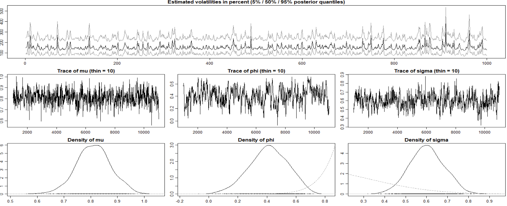
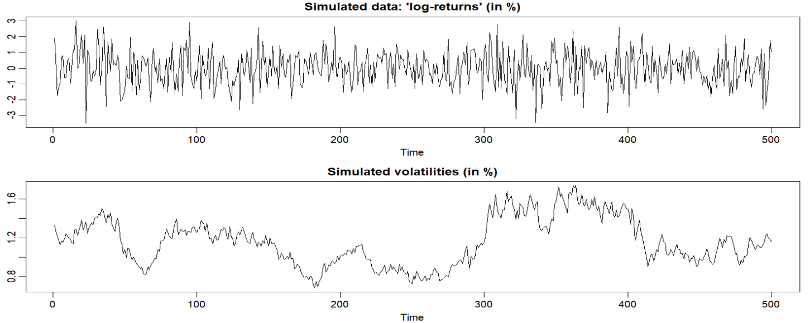
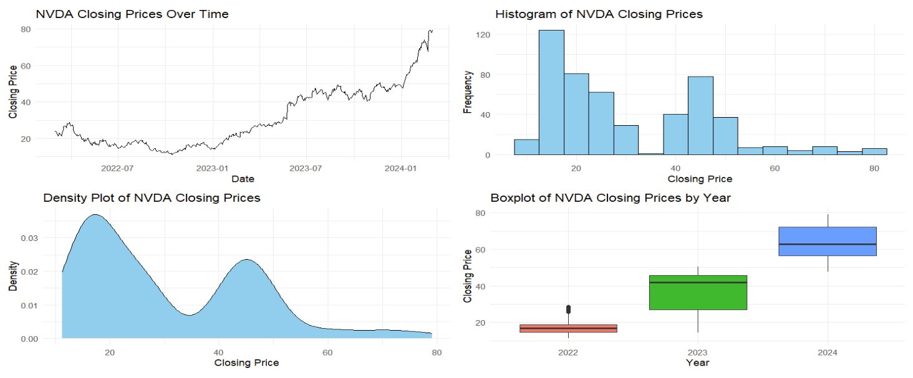
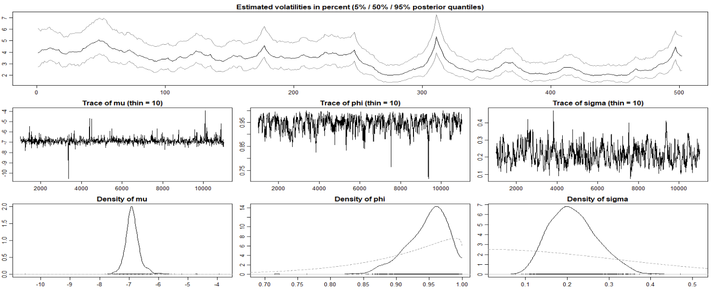
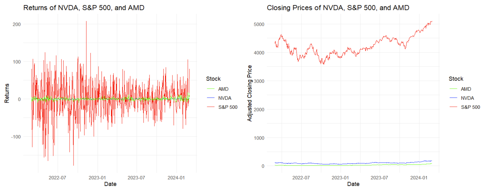
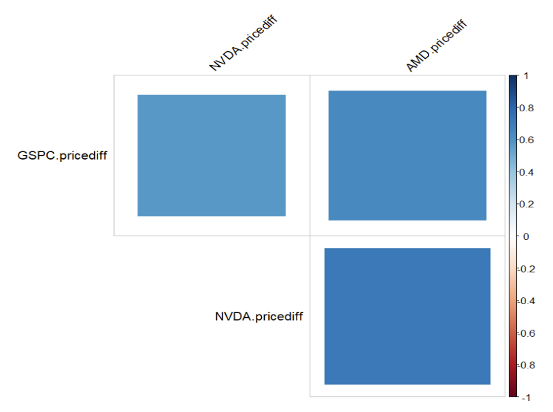
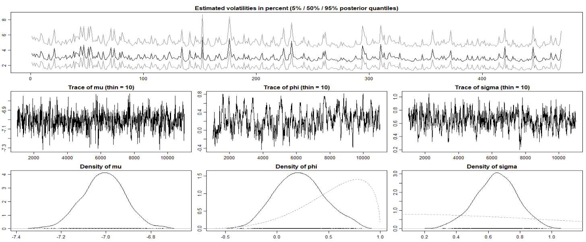
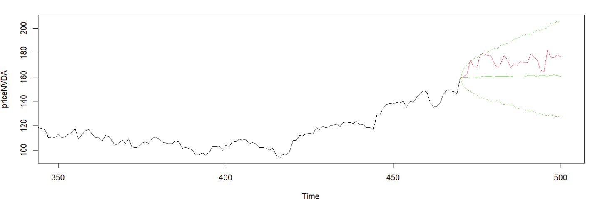

#### [<back to projects](./projects.md)
# Time Series using Stochastic Volatility
## Introduction
In the finance landscape, markets are unmethodical and easily influenced by outside factors.
Commonly, modeling these markets assumed constant volatility, an ever-steady increase or decrease in
the mean. However, these models failed to capture the complexities of nature that influence markets,
which are often unpredictable and unsteady. Enter stochastic volatility models, a time series modelling
technique. Unlike other methods, stochastic volatility does not assume that volatility is constant, and
instead considers volatility a random process.

To contribute to the use of stochastic volatility models in financial markets, we decided to use a
dataset which contains stock pricing information on Nvidia from March 1
st, 2022, to March 1st, 2024. We
obtained this data using the quantmod package in R. The intent is to forecast stock prices. Nvidia is a
company renowned for its developments in technology and AI. Since 2017, Nvidia has seen a massive
increase in its stock price. However, like all companies and all markets, volatility is not constant and
experiences random fluctuations as well. Using stochastic volatility modeling processes, we aim to
predict future stock prices, considering random variability. 

## Toy Example

```{r}
# Simulate data from a stochastic volatility model
set.seed(123)
n <- 1000
volatility <- rnorm(n, mean = 0, sd = sqrt(1))
returns <- volatility + rnorm(n, mean = 0, sd = exp(volatility / 2))

# Fit stochastic volatility model
fit <- svsample(returns, 
                priormu = c(-10, 1), 
                priorphi = c(20, 1.1),
                priorsigma = 0.1, 
                thin = 10)

# Summary of the fitted model
summary(fit)

# Plot of estimated volatility
plot(fit)
```

```{r}
sim <- svsim(500, mu = -9, phi = 0.99, sigma = 0.1)
par(mfrow = c(2, 1))
plot(sim)

fit <- svsample(sim, 
                priormu = c(-10, 1), 
                priorphi = c(20, 1.1),
                priorsigma = 0.1, 
                thin = 10)

# Summary of the fitted model
summary(sim)

# Plot of estimated volatility
plot(sim)

```


## EDA for NVDA

```{r}
NVDA = getSymbols.yahoo('NVDA', from='2022-03-01', to='2024-03-01',auto.assign = FALSE)
NVDAdf = data.frame(NVDA$NVDA.Close)
names(NVDAdf) = c("price")
NVDAdf$date <- ymd(rownames(NVDAdf)) 

# Summary statistics
summary(NVDAdf$price)

# Plot the time series of NVDA closing prices
ggplot(NVDAdf, aes(x = date, y = price)) +
  geom_line() +
  labs(x = "Date", y = "Closing Price", title = "NVDA Closing Prices Over Time") +
  theme_minimal()

# Histogram of NVDA closing prices
ggplot(NVDAdf, aes(x = price)) +
  geom_histogram(binwidth = 5, fill = "skyblue", color = "black") +
  labs(x = "Closing Price", y = "Frequency", title = "Histogram of NVDA Closing Prices") +
  theme_minimal()

# Density plot of NVDA closing prices
ggplot(NVDAdf, aes(x = price)) +
  geom_density(fill = "skyblue", color = "black") +
  labs(x = "Closing Price", y = "Density", title = "Density Plot of NVDA Closing Prices") +
  theme_minimal()

# Boxplot of NVDA closing prices by year
NVDAdf$year <- lubridate::year(NVDAdf$date)
ggplot(NVDAdf, aes(x = factor(year), y = price, fill = factor(year))) +
  geom_boxplot() +
  labs(x = "Year", y = "Closing Price", title = "Boxplot of NVDA Closing Prices by Year") +
  theme_minimal() +
  theme(legend.position = "none")
```

## Simple Stochastic Volatility example for NVDA

```{r}
NVDAdf$logpricediff <- NA

for (i in 1:(length(NVDAdf$price)- 1)){
  NVDAdf$logpricediff[i] <- log(NVDAdf$price[i+1])-log(NVDAdf$price[i])
}

#Taking out the NA at the end
logpricediff_subset <- NVDAdf$logpricediff[-length(NVDAdf$logpricediff)]

# CHange this
fitNVDA <- svsample(logpricediff_subset, 
                priormu = c(0, 100), # vague prior 
                priorphi = c(20, 1.1),# vague
                priorsigma = 0.1, # vague
                thin = 10)

# Summary of the fitted model
summary(fitNVDA)

# Plot of estimated volatility
plot(fitNVDA)
```



## Choosing two other securities to provide the prior

```{r}
NVDA = getSymbols.yahoo('NVDA', from='2022-03-01', to='2024-03-01',auto.assign = FALSE)
NVDAdf = data.frame(NVDA$NVDA.Close)
names(NVDAdf) = c("NVDA.price")
NVDAdf$date <- ymd(rownames(NVDAdf)) 

# NVDA daily returns
for (i in 1:(length(NVDAdf$NVDA.price)- 1)){
  NVDAdf$NVDA.pricediff[i] <- NVDAdf$NVDA.price[i+1]-NVDAdf$NVDA.price[i]
}

# Subsetting the dataframe to keep only "date" and "NVDA.pricediff" columns
NVDA_df <- NVDAdf[, c("date", "NVDA.pricediff")]

GSPC = getSymbols.yahoo('^GSPC', from='2022-03-01', to='2024-03-01',auto.assign = FALSE)
GSPCdf = data.frame(GSPC$GSPC.Close)
names(GSPCdf) = c("GSPC.price")
GSPCdf$date <- ymd(rownames(GSPCdf)) 

# S&P500 returns
for (i in 1:(length(GSPCdf$GSPC.price)- 1)){
  GSPCdf$GSPC.pricediff[i] <- GSPCdf$GSPC.price[i+1]-GSPCdf$GSPC.price[i]
}

# Subsetting the dataframe to keep only "date" and "GSPC.pricediff" columns
GSPC_df <- GSPCdf[, c("date", "GSPC.pricediff")]

AMD = getSymbols.yahoo('AMD', from='2022-03-01', to='2024-03-01',auto.assign = FALSE)
AMDdf = data.frame(AMD$AMD.Close)
names(AMDdf) = c("AMD.price")
AMDdf$date <- ymd(rownames(AMDdf)) 

# AMD daily returns
for (i in 1:(length(AMDdf$AMD.price)- 1)){
  AMDdf$AMD.pricediff[i] <- AMDdf$AMD.price[i+1]-AMDdf$AMD.price[i]
}

# Subsetting the dataframe to keep only "date" and "AMD.pricediff" columns
AMD_df <- AMDdf[, c("date", "AMD.pricediff")]


# Merge the data frames keeping only the NVDA.prices, GSPC.prices, and AMD.prices columns

closing_df <- merge(NVDAdf, GSPCdf, by = "date", all = TRUE)
closing_df <- merge(closing_df, AMDdf, by = "date", all = TRUE)

closing_df <- closing_df[, c("date", "AMD.price", "GSPC.price", "NVDA.price")]

# Merging the DF's
returns_df <- merge(NVDA_df, GSPC_df, by = "date", all = TRUE)
returns_df <- merge(returns_df, AMD_df, by = "date", all = TRUE)

# Rename columns
colnames(closing_df) <- c("date", "NVDA.closing", "GSPC.closing", "AMD.closing")
colnames(returns_df) <- c("date", "NVDA.pricediff", "GSPC.pricediff", "AMD.pricediff")

# Display the combined data frame
head(closing_df)
head(returns_df)

dim(returns_df)
dim(closing_df)
```

## Comparing the three Securities

```{r}
# Convert date to date format
combined_df$date <- as.Date(combined_df$date)

# Plot using ggplot
ggplot(combined_df, aes(x = date)) +
  geom_line(aes(y = NVDA.pricediff, color = "NVDA")) +
  geom_line(aes(y = GSPC.pricediff, color = "S&P 500")) +
  geom_line(aes(y = AMD.pricediff, color = "AMD")) +
  labs(x = "Date", y = "Returns", color = "Stock") +
  scale_color_manual(values = c("NVDA" = "blue", "S&P 500" = "red", "AMD" = "green")) +
  theme_minimal() +
  ggtitle("Returns of NVDA, S&P 500, and AMD")

# Plot using ggplot
ggplot(closing_df, aes(x = date)) +
  geom_line(aes(y = NVDA.closing, color = "NVDA")) +
  geom_line(aes(y = GSPC.closing, color = "S&P 500")) +
  geom_line(aes(y = AMD.closing, color = "AMD")) +
  labs(x = "Date", y = "Adjusted Closing Price", color = "Stock") +
  scale_color_manual(values = c("NVDA" = "blue", "S&P 500" = "red", "AMD" = "green")) +
  theme_minimal() +
  ggtitle("Closing Prices of NVDA, S&P 500, and AMD")

```


# Correlation Matrix

```{r}
# taking date out of the df
matrix_df <- returns_df[, -1] 

# Compute the correlation matrix
correlation_matrix <- cor(matrix_df)

correlation_matrix

# Plot the correlation matrix using corrplot
corrplot(correlation_matrix, method = "square", type = "upper", order = "hclust",
         tl.col = "black", tl.srt = 45, diag = FALSE)

```


# Stochastic Volatility for NVDA w/ S&P500 and AMD prior

```{r}
# Predicting NVDA based on S&P500 and AMD in the mean
data(returns_df)
len <- 470
ahead <- 30

# Calculate log-returns
logreturns <- apply(closing_df[, c("NVDA.closing", "GSPC.closing", "AMD.closing")], 2,
                    function (x) diff(log(x)))
logretNVDA <- logreturns[2:(len+1), "NVDA.closing"]
regressors <- cbind(1, as.matrix(logreturns[1:len, ]))  # lagged by 1 day

# Fit SV model
res <- svsample(logretNVDA, designmatrix = regressors, thin = 10)

plot(res)
```



### Predicting Based on the Model with S&P500 and AMD prior 30 days ahead

```{r}
# Use predict.svdraws to obtain predictive distributions
predregressors <- cbind(1, as.matrix(logreturns[(len+1):(len+ahead), ]))
preddraws <- predict(res, steps = ahead,
                     newdata = predregressors)
predprice <- closing_df[len+2, "NVDA.closing"] * exp(t(apply(predy(preddraws), 1, cumsum)))

# Calculate predictive quantiles
predquants <- apply(predprice, 2, quantile, c(.1, .5, .9))

# Visualize
priceNVDA <- closing_df[3:(len+2), "NVDA.closing"]
expost <- closing_df[(len+3):(len+ahead+2), "NVDA.closing"]
ts.plot(priceNVDA, xlim = c(len-4*ahead, len+ahead+1),
	       ylim = range(c(expost, predquants, tail(priceNVDA, 4*ahead))))
for (i in 1:3) {
  lines(len:(len+ahead), c(tail(priceNVDA, 1), predquants[i,]),
        col = 3, lty = c(2, 1, 2)[i])
}
lines(len:(len+ahead), c(tail(priceNVDA, 1), expost),
      col = 2)
```

