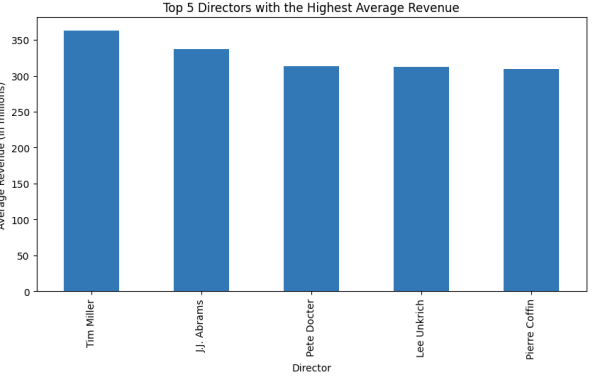
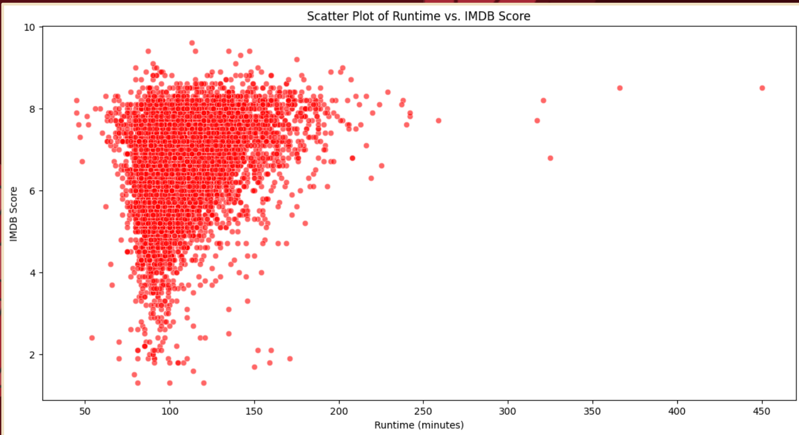

#### [<back to projects](./projects.md)
# Web Scraping in Python using Beautiful Soup
## Introduction
blah blah

## Scraping
```{python}
url='https://www.imdb.com/search/title/?sort=user_rating,desc&groups=top_1000' #'https://www.imdb.com'#
page=requests.get(url,headers=HEADERS)
page

HTTPStatus(page.status_code).phrase

soup=BeautifulSoup(page.content,'html')

soup.prettify()

dataDict1 = {
    'Title': [],
    'Year Released, Movie Length, Rating': [],
    'Review Score': [],
    'Description': [],
    'Vote': [],
    'Metascore': []
}

movieCards=soup.find_all('div',class_='sc-53c98e73-4 gOfInm dli-parent')
for card_content in movieCards:
    dataDict1['Title'].append(card_content.find('div',class_="ipc-title ipc-title--base ipc-title--title ipc-title-link-no-icon ipc-title--on-textPrimary sc-43986a27-9 gaoUku dli-title").text.strip())
    dataDict1['Year Released, Movie Length, Rating'].append(card_content.find('div',class_='sc-43986a27-7 dBkaPT dli-title-metadata').text.strip())
    dataDict1['Review Score'].append(card_content.find('div',class_='sc-e3e7b191-0 jlKVfJ sc-43986a27-2 bvCMEK dli-ratings-container').text.strip())
    dataDict1['Description'].append(card_content.find('div',class_='ipc-html-content-inner-div').text.strip())
    dataDict1['Vote'].append(card_content.find('div',class_='sc-53c98e73-0 kRnqtn').text.strip())
    metascore_element = card_content.find('span', class_='sc-b0901df4-0 bcQdDJ metacritic-score-box')
    if metascore_element is not None:
      dataDict1['Metascore'].append(metascore_element.text.strip())
    else:
      dataDict1['Metascore'].append('')

def convert_to_minutes(time_str):
    time = time_str.split(' ')
    minutes = 0
    for part in time:
        if 'h' in part:
            minutes += int(part.rstrip('h')) * 60
        elif 'm' in part:
            minutes += int(part.rstrip('m'))
    return minutes

imdb = pd.DataFrame.from_dict(dataDict1)
imdb['Year'] = imdb['Year Released, Movie Length, Rating'].str.extract(r'^(\d{4})')
imdb['Movie Length and Rating'] = imdb['Year Released, Movie Length, Rating'].str[4:]
imdb['Movie Length'] = imdb['Movie Length and Rating'].str.extract(r'(.*m)')
imdb['Rating'] =  imdb['Movie Length and Rating'].str.extract(r'm(.*)')
imdb = imdb.drop('Movie Length and Rating', axis = 1)
imdb = imdb.drop('Year Released, Movie Length, Rating', axis = 1)
imdb['Score'] = imdb['Review Score'].str.extract(r'(\d\.\d)')
imdb['Vote'] = imdb['Vote'].str.replace('Votes', '', regex=False)
imdb['Rank'] = imdb['Title'].str.split('.').str[0]
imdb['Title'] = imdb['Title'].str.replace(r'^\d+\.', '', regex=True)
imdb['Runtime'] = imdb['Movie Length'].apply(convert_to_minutes)
imdb = imdb.drop('Movie Length', axis=1)
imdb = imdb.drop('Review Score', axis=1)
imdb
```


## Exploratory Data Analysis
```{python}
#Distribution of movies over time
distofmovies_plot = movies.groupby('Decade')['Title'].count().plot(kind = 'bar', title = 'Distribution of Movies Over Decades')
distofmovies_plot
```

Words


```{python}
#Histogram of Critic Score and Score
movies['CriticScore'] = movies['Metascore']/10
plt.hist(movies['Score'], alpha = .5, bins = 10, color= 'blue', label =  'Score')
plt.hist(movies['CriticScore'], alpha = .5, bins = 10, color = 'pink', label = 'Critic Score')
plt.legend(loc = 'upper right')
plt.title('Histogram of Critic Score and Score')
plt.show()
```

Words


```{python}
movies['Genre'] = movies['Genre'].str.split(', ')
movies = movies.explode('Genre')

# Calculate the mean Score and Revenue by Genre
genre_stats = movies.groupby('Genre')['Score', 'Revenue'].mean().sort_values('Revenue', ascending=False).head(10)

# Plotting
fig, ax = plt.subplots(figsize=(14, 8))

# Plot average revenue by genre
genre_stats['Revenue'].plot(kind='bar', color='blue', ax=ax, width=0.4, position=1, label='Average Revenue (in millions)')

# Plot average score by genre on a secondary axis
ax2 = ax.twinx()
genre_stats['Score'].plot(kind='bar', color='orange', ax=ax2, width=0.4, position=0, label='Average Score')

# Set the labels and titles
ax.set_ylabel('Average Revenue (in millions)', color='blue')
ax2.set_ylabel('Average Score', color='orange')
ax.set_xlabel('Genre')
ax.set_title('Average Score and Revenue by Genre')

# Set legends
ax.legend(loc='upper left')
ax2.legend(loc='upper right')

plt.show()
```

Words


```{python}
correlation_matrix = movies[['Score', 'Metascore', 'Vote', 'Runtime', 'Revenue']].corr()
plt.figure(figsize=(10, 8))
sns.heatmap(correlation_matrix, annot=True, cmap='coolwarm')
plt.title('Correlation Heatmap of Numerical Features')
plt.show()
```

Words


```{python}
average_revenue_by_director = movies.groupby('Director')['Revenue'].mean().nlargest(5)
plt.figure(figsize=(10, 5))
average_revenue_by_director.plot(kind='bar')
plt.title('Top 5 Directors with the Highest Average Revenue')
plt.ylabel('Average Revenue (in millions)')
plt.show()
```

Words



## Bivariate Analysis
```{python}
plt.figure(figsize=(14, 7))
sns.scatterplot(data=movies, x='Runtime', y='Score', alpha=0.6, color='red')
plt.title('Scatter Plot of Runtime vs. IMDB Score')
plt.xlabel('Runtime (minutes)')
plt.ylabel('IMDB Score')
plt.show()
```

Words



```{python}
plt.figure(figsize=(14, 7))
sns.scatterplot(data=movies, x='Year', y='Score', alpha=0.6, color='green')
plt.title('Scatter Plot of Year of Release vs. IMDB Score')
plt.xlabel('Year of Release')
plt.ylabel('IMDB Score')
plt.show()
```

Words


## Text Analysis
```{python}

```

Words

!

## Comparative Analysis


## Multivariate Analysis

