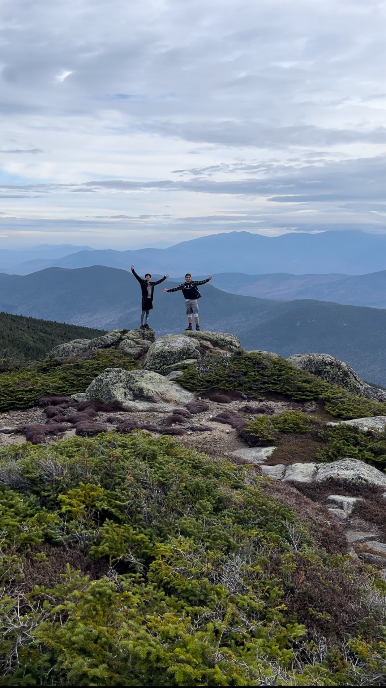

#### [< back to homepage](./index.md)
My name is Samuel Volpone, recent graduate of the University of New Hampshire.  I recieved my Masters is Business Analytics in September of 2024. I also graduated in September of 2023 with a Bachelors in Business Administration - Finance, as well as Business Administration - Information Systems and Business Analytics. I'm a quick learner, and hope to join the workforce soon!

Outside of work/school I enjoy a few hobbies in the outdoors like hiking, surfing, as well as playing basketball. I recently compeleted hiking the 48 4000 foot peaks in New Hampshire! 

A few random facts about me -
* I have made ratatouille before (yes like the movie)
* I have been to 26 states
* My current favorite TV Show is Clarksons Farm
* I take fantasy football very seriously
* My current favorite game is Brawl Stars

Here is a picture of my friend Chris and I on South Twin mountain last summer!

