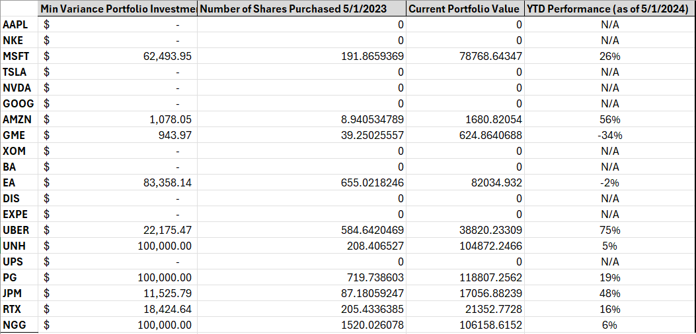

#### [<back to projects](./projects.md)
# Optimally Weighted Porfolio
## Introduction
Portfolio optimization is a fundamental concept in finance that focuses on selecting the best mix of assets to maximize returns while minimizing risk. One of the most widely used methods for evaluating and optimizing portfolios is based on the Sharpe Ratio, developed by Nobel laureate William F. Sharpe in 1966. The Sharpe Ratio measures the performance of an investment compared to a risk-free asset, after adjusting for its risk. This method, in combination with minimum variance, and equally weighted methods will be used in evaluating the performance of a portfolio of 20 securities over the span of a year. 

## Gathering the Securities
Adjusting closing prices for the 20 securities chosen will account for dividends and stock splits if applicable. 

Now we must standardize to get % returns per month. 

